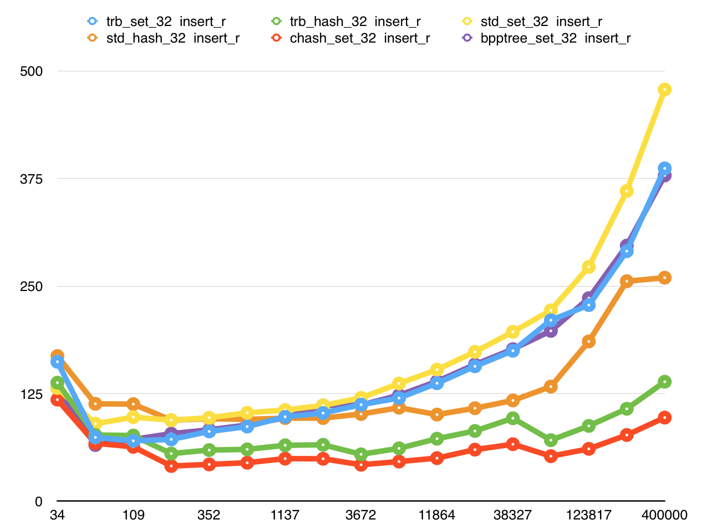
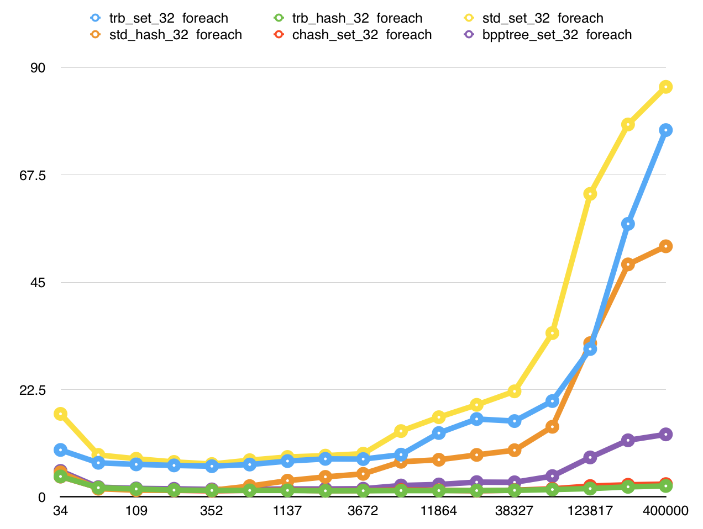

工作需要,轮了一个 **线索红黑树** 调研用

**线索红黑树** 是使用红黑树平衡策略的线索二叉树

实现方式是作为算法组件出现  
设计时候着重考虑这两点  

* 内存紧凑  
* 可定制化  

内存紧凑的表现方式为:  
1. 使用下标替代指针  
2. 下标的最高2位被提出作为flag  
3. 所有节点全部由类vector容器连续分配  

可定制化的表现方式为:  
1. 下标类型可以自己指定  
2. 类vector容器可以自己定制  
3. 如果有必要,可以分离节点和数据  
4. 如果有必要,可以不维护const  
5. 如果有必要,可以不维护最小/大元素  

带来的问题:  
1. 下标被提出2位,指定了偏移类型,容量上限被削减  
2. 类vector内存策略,数据会扩容搬运,无法保证元素引用有效性  

带来的好处:  
1. 内存是连续的,缓存命中率更高  
2. 内存是连续的,内存占用比节点方式小的多  
3. 可以作为其它容器内部组件  

基本的介绍就到这里.  

继续简单提一下 **threaded_rbtree_hash**  
(谁来告诉我这东西竟要怎么用中文简单讲出来???)  

思路就是用 *线索红黑树* 作为 *哈希表* 的冲突链  
设计方式同上,不再阐述.  

至于效果如何...  
只能说,比原本的冲突链还是慢一些,慢的有限  
具体数据看下面图表吧  

## 图例说明  
* 容器类型  
    * trb_set 为线索红黑树  
    * trb_hash 为使用线索红黑树作为冲突链的哈希表  
    * std_set 为标准库std::set  
    * std_hash 为标准库std::unordered_set  
    * chash_set 为使用连续内存策略的哈希表  
    * bpptree_set 为B+树实现的map  
* 坐标轴  
    * 横轴 为元素数量  
    * 纵轴 为总时间/元素数量(纳秒)  

## 随机插入  

## 查找  

## 遍历  

## 删除  

注:  
测试中标准库容器使用默认allocator  
对节点方式工作的容器不友好,仅作为参考  

OSX 10.11.3 (15D21)  
XCode 7.1.1 (7B1005)  
2.5 GHz Intel Core i7  
16 GB 1600 MHz DDR3  

[传送门: github.com/Terark/threaded-rb-tree](https://github.com/Terark/threaded-rb-tree)