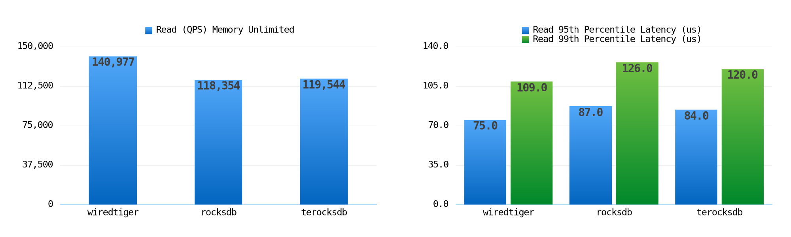

# 集成 TerocksDB 的 MongoDB 性能测试

### 目录
- 1.前言
- 2.测试方式
- 3.写性能与压缩率
- 4.读性能
  - 4.1.数据远小于内存（内存64GB）
  - 4.2.数据略小于内存（内存8GB）
  - 4.3.数据略大于内存（内存4GB）
  - 4.4.数据大于内存（内存2GB）

### 1.前言
我们将 TerocksDB 集成到了 MongoDB 社区版中，后续我们会逐步发布性能测试报告。

### 2.测试方式
- 测试工具
  - YCSB([https://github.com/Terark/YCSB-mongo](https://github.com/Terark/YCSB-mongo))
- 测试数据
  - 由于YCSB的数据都是纯随机字符串生成的，离用户的真实场景相差较大，我们采用了[Amazon movie data (~8 million reviews)](https://snap.stanford.edu/data/web-Movies.html)数据进行测试
- 测试数据集尺寸
  - 约为9.1GB
  - 约800万条数据
  - 平均每条数据大约1KB
- 测试使用的引擎
  - MongoDB默认存储引擎Wiredtiger
  - Facebook官方适配RocksDB到MongoDB存储引擎Mongo-Rocks([https://github.com/mongodb-partners/mongo-rocks](https://github.com/mongodb-partners/mongo-rocks))
  - Terark适配RocksDB后的TerocksDB再适配Mongo-Rocks
- 读性能测试均是**均匀分布**与**齐普夫分布**测试
- 这里测量了读95/99分位延迟数据

### 3.写性能与压缩率
由于压缩率与机器的内存无关，以下各种内存情况下的压缩率均为：

### 4.读性能
我们在开始读性能测试之前，首先批量的将所有数据写入数据库，然后重启服务器后开始测试。需要注意的是，除了数据远小于内存，其它的的读测试均是**均匀分布**与**齐普夫分布**测试。

- 内存受限情况，我们使用 cgroups 达成
- 其中 Rocksdb 开启 allow_mmap_reads 选项
- RocksDB 与 TerocksDB 测试客户端均在本机启动，全程占用 240% CPU
- Wiredtiger 使用文件IO接口读取文件，cgroups 无法限制系统缓存，所以使用内核参数限制内存，此时测试客户端运行在内网其它服务器

#### 4.1.数据远小于内存（内存64GB）

#### 4.2.数据略小于内存（内存8GB）

#### 4.3.数据略大于内存（内存4GB）

#### 4.4.数据大于内存（内存2GB）

